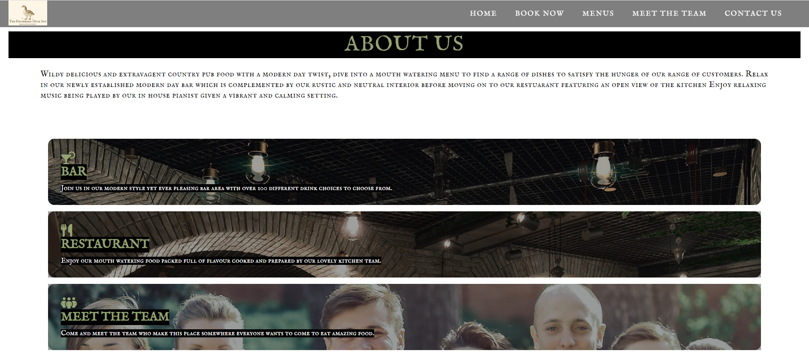

# The Feathered Duck Inn
(Developer: Zack Owen)

[Live webpage](https://deadenigma13.github.io/CI_PP1_TFDI/)

## Table Of Content

1. [Project Goals](#project-goals)
    1. [User Goals](user-goals)
    2. [Site Owner Goals](#site-owner-goals)
2. [User Experience](#user-experience)
    1. [Target Audience](#target-audience)
    2. [User Requirements and Expectations](#user-expectations)
    3. [User Stories](#user-stories)
3. [Design](#design)
    1. [Design Choices](#design-choices)
    2. [Colour](#colours)
    3. [Fonts](#fonts)
    4. [Structure](#structure)
    5. [Wireframes](#wireframes)
4. [Technologies Used](#technologies-used)
    1. [Languages](#languages)
    2. [Frameworks & Tools](#frameworks-&-tools)
5. [Features](#features)
6. [Testing](#validation)
    1. [HTML Validation](#HTML-validation)
    2. [CSS Validation](#CSS-validation)
    3. [Accessibility](#accessibility)
    4. [Performance](#performance)
    5. [Device Testing](#performing-tests-on-various-devices)
    6. [Browser Compatibility](#browser-compatability)
    7. [Testing User Stories](#testing-user-stories)
8. [Bugs](#Bugs)
9. [Deployment](#deployment)
10. [Credits](#credits)
11. [Acknowledgements](#acknowledgements)

## Project Goals

### User Goals
- Find a restaurant that provides great food and caters to everyone.
- View a menu that displays clear prices and options.
- Find the location of the restaurant.
- Obtain information about the restaurant.

### Site Owner Goals
- Maximise the number of customers visting the site.
- Promote the restaurant.
- Provide information to new and existing customers.
- Deliver important information about the business to all customers.
## User Experience

### Target Audience
- Anyone looking to dine out.
- Couples who want to come for a romantic meal.
- Groups who are celebrating special occasions.

### User Requirements and Expectations
- A simple navigation system to get around the site.
- Be able to find the relative information quickly and easily.
- All links and downloadable content works.
- Simple but yet well presented design that is easy to look at on all screen sizes.
- A quick and easy way to contact the restaurant.
- Information that is easily readable.
- Accessibility.

### User Stories

#### First-time User
1. As a first-user, being able to navigate the website with ease and be able to understand the information on the page.
2. As a first-user, looking for information to the food being provided at the restaurant and have a clear vision of pricing.
3. As a first-user, I want to be able to download a menu to view offline at any time before booking a table.
4. As a first-user, I want to find where the restaurant is located.
#### Returning User
5. As a returning user, getting to know the staff is something that I find interesting, being able to see who is working there beforehand should be provided.
6. As a returning user, I want be able to book a table for 6 people on a specific date and get confirmation of my booking.
7. As a returning user, I want to be able to contact the restuarant via email or phone about queiries I may have.
8. As a returning user, I want to find the social media page for the restaurant.
9. As a returning user, I want to know the latest news such as new menu or special offers.
#### Site Owner
10. As the site owner, I want new and existing users to find news about special offers and new menus.
11. As the site owner, I want users to get an understanding for the restaurant and staff.
12. As the site owner, I want users to find the relevant contact information.
## Design

### Design Choices
The website has been designed so customers get to know what the restaurant looks like beforehand so when they visit they feel welcome.
Parts of the design have been made to look modern but old fashioned to resemble the restaurant theme.

### Colour
The colour scheme was picked to give a natural warm vibe but not being too bright, I narrowed down the colours by using Adobe Color. I tested the colours using WebAIM to make sure the contrast was easy on the eye for user.

### Fonts
IM Fell English SC with Nanum Gothic as fallback were used for the heading and paragraphs as this gave a rustic but yet modern feeling to the restaurant design.

### Structure
The page is structured in a user friendly, easy to learn way so users who arrive on to the site know exactly how to navigate the page without any difficulty. The logo is placed on the left hand side and the navigation links to the right which is a very common layout for webpages.
The website contains 5 seperate pages:
- A home page with news and contact information.
- A book now page for table bookings.
- A menus page.
- A meet the team page
- A contact page with a map api.

### Wireframes
The project templates and wireframes for The Feathered Duck Inn restaurant were designed using [Balsamiq](https://balsamiq.com/). The design layout on every page is fairly identical which was a creative decision made whilst coding to keep it easy for the user.

## Technologies Used

### Languages
- HTML
- CSS
- JavaScript

### Frameworks & Tools
- Git
- GitHub
- Gitpod
- Balsamiq
- Google Fonts
- Adobe Color
- Font Awesome
- Favicon.io

## Features
The webpage consists of five pages and 9 features

### Logo and Navigation Bar
- Featured on all five pages
- The navigation bar is fully responsive and changes to a toggle menu (Hamburger menu) on small screens and includes links to the Homepage, Book Now Page, Menus Page, Meet The Team Page and the Contact Us Page.
- It allows users to navigate the webpage with ease.
- The navbar displays what option the user is currently hovering over or clicking on.
- User stories covered: 1

### Hero Image 
- Introduces the user to the webpage with a large image showing what the restaurant looks like
- Hero image displays the name of the restaurant and an immediate option to book a table for returning users

### About Us
- Gives a description about the restaurant and its facilities with an image of the bar and restaurant.
- User stories covered: 11.

### Footer
- Featured on all pages
- Consists of the name of the restaurant followed by social media accounts with clickable icons.
- User stories covered: 8

### News Blog
- Allows users to see when the menu has been changed and any special offers that may be on.
- Gives users an option to download the latest menu to view offline.
- User stories covered: 1, 3, 9, 10

### Menu
- Gives the users an overview on the menu in 5 sections: Starters, Mains, Classics, Desserts & Sides.
- Each section is attached with an image of one of the items on the menu.
- Features pricing.
- User stories covered: 1, 2

### Contact Us
- Gives users information on how to contact the restaurant with any queries or issues.
- User stories covered: 7, 12

### Map
- Shows the restaurant location on an embeded Google Map
- User stories covered: 4

### Book Now 
- Users can book a table by filling out a form with their details followed by a confirmation screen.
- User stories covered: 6

## Validation
The W3C Markup Validation Service was used to validate the HTML of the website. All pages pass with no errors and 1 warning showing.

Home

Book Now

Menus

Meet The Team

Contact Us

### CSS Validation
The W3C Jigsaw CSS Validation Service was used to validate the CSS style of the website. When validating just my own custom CSS it passes with no errors and no warnings.

style.css

